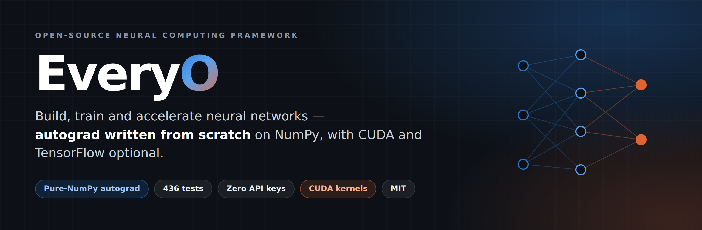
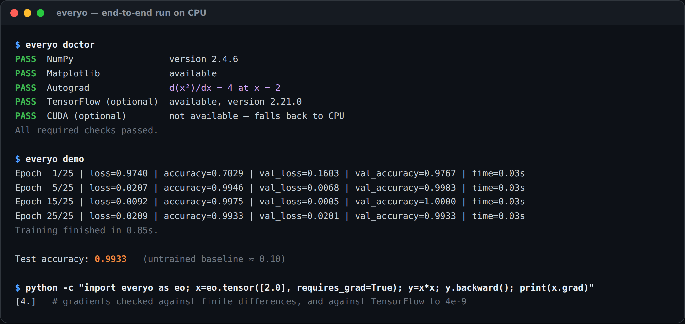
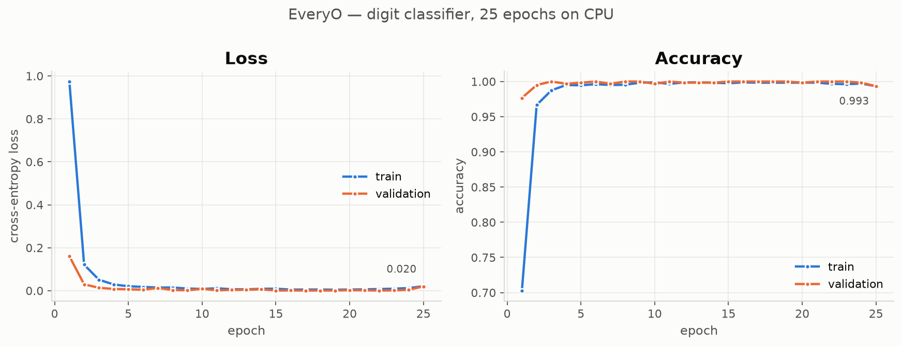
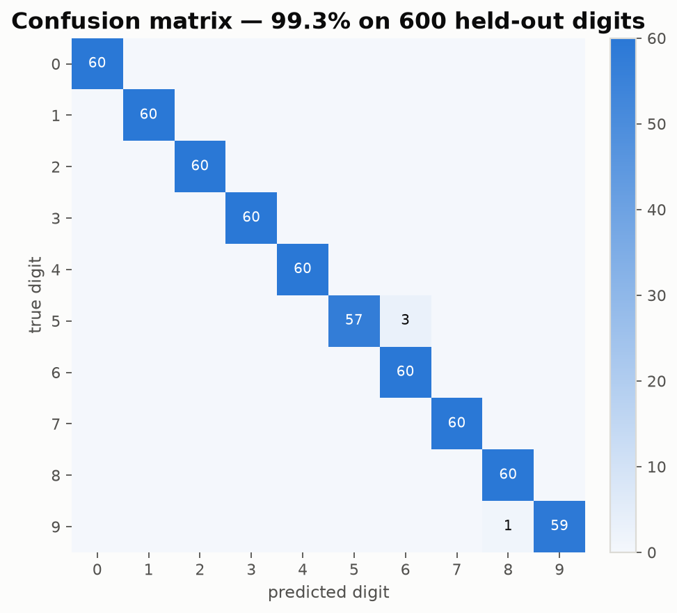
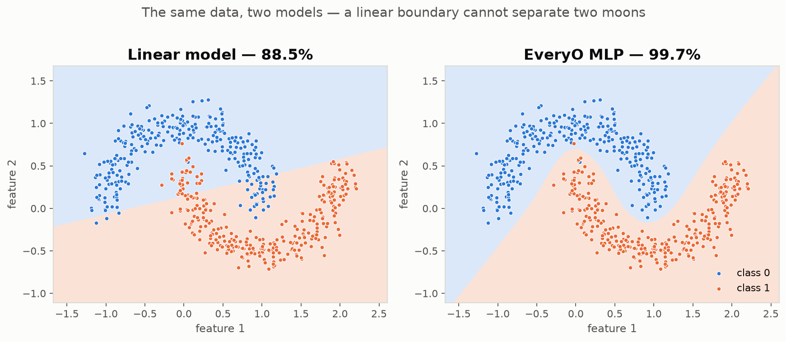
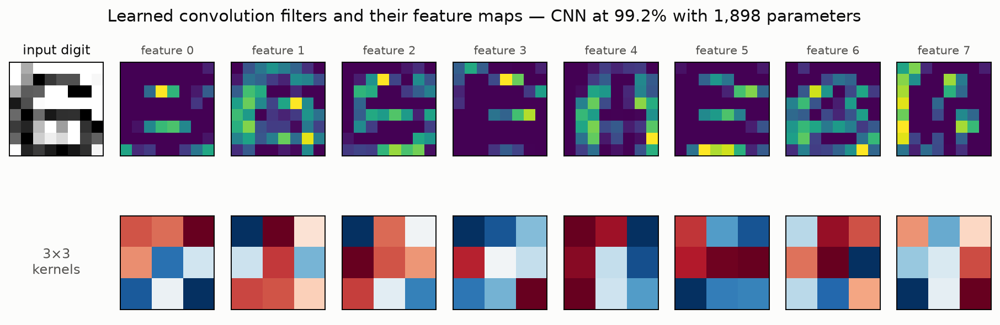
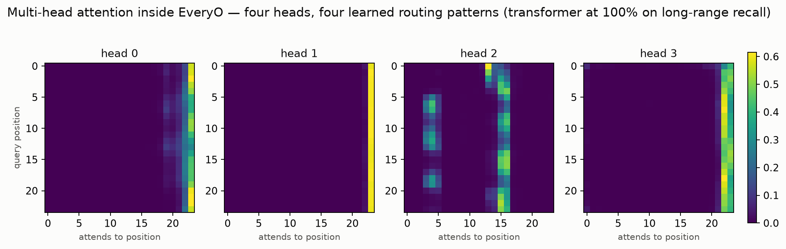

<div align="center">



<h3>Neural networks, from the math up — not from a wrapper down.</h3>

<p><b>EveryO</b> is a neural computing framework whose autograd engine, layers, optimizers and training loop
are written from scratch on NumPy — then accelerated with optional CUDA kernels and cross-checked against TensorFlow.<br>
Small enough to read in an afternoon. Correct enough to trust.</p>

[](https://github.com/krishanth7/EveryO/actions/workflows/tests.yml)
[](https://github.com/krishanth7/EveryO/actions/workflows/cuda-build.yml)
[](https://www.python.org/)
[](LICENSE)
[](https://docs.astral.sh/ruff/)
[](CONTRIBUTING.md)
[](https://github.com/krishanth7/EveryO/stargazers)

**[What is EveryO?](#what-is-everyo) · [Quick start](#-quick-start-60-seconds) · [What it does](#-what-it-actually-does) · [Results](#-results-from-a-real-run) · [Architecture](#-architecture) · [Roadmap](#-roadmap) · [Contribute](#-contributing) · [Governance](#-governance-and-project-policies)**

</div>

---

## What is EveryO?

EveryO is a **neural network framework written from scratch in Python**. Tensors, reverse-mode
automatic differentiation, layers, optimizers, the training loop, serialization — all of it is
implemented here, on top of NumPy. It is not a wrapper around PyTorch, TensorFlow or JAX, and it
does not call out to one at runtime.

The point is legibility. The gradient engine is **251 lines**. The whole package is **~11,500 lines**
across 65 focused modules. You can follow one number from `loss.backward()` through the graph walk,
into a matrix multiply, and out to a hand-written CUDA kernel — reading real code the entire way.

Legibility is worthless without correctness, so every differentiable operation is checked against
central finite differences, and the numerical results are checked against TensorFlow. Where the two
disagree, the README says by how much.

```
BUILD  →  TRAIN  →  MEASURE  →  UNDERSTAND  →  ACCELERATE
```

### Who it is for

- **People learning how deep learning actually works** — you can read the derivative of every
  operation you use, not just call it.
- **Engineers who need to verify a result** — a small, deterministic, dependency-light reference
  you can step through in a debugger.
- **Teachers and students** — no accounts, no API keys, no downloads, no network access. `pip install -e .`
  and everything in this README runs.

### What it is not

EveryO is **not a production training runtime**. The roadmap is finished, but "implemented" is not
"battle-tested": it will not out-perform a tuned framework on a large model, its CUDA path needs a
GPU that this project's CI does not have, and multi-node training has been exercised across
processes rather than across machines. Those limits are stated where they apply rather than left
for you to discover — the [Roadmap](#-roadmap) says exactly what was verified and how.

### How to trust it

| Question | Where it is answered |
|---|---|
| Are the gradients right? | [Correctness is the feature](#-correctness-is-the-feature) — finite differences and TensorFlow, with the exact deltas |
| How is it put together? | [Architecture](#-architecture) and [docs/architecture.md](docs/architecture.md) |
| Is it safe to load a model? | [Security](#-security) — `.evo` archives are pickle-free and cannot execute code |
| Who decides what ships? | [Governance](GOVERNANCE.md) and [Project policy](PROJECT_POLICY.md) |
| How do I get help? | [Support](SUPPORT.md) |

<div align="center">

</div>

---

## ⚡ Quick start (60 seconds)

```bash
git clone https://github.com/krishanth7/EveryO.git
cd EveryO && pip install -e .
everyo demo          # trains a digit classifier end to end
```

```python
import everyo as eo

x = eo.tensor([2.0], requires_grad=True)
y = x * x
y.backward()

print(x.grad)  # [4.]   ← your own autograd engine, not a binding
```

Build and train a network:

```python
model = eo.Sequential(
    eo.Linear(64, 128),
    eo.ReLU(),
    eo.Dropout(0.2),
    eo.Linear(128, 10),
)

trainer = eo.Trainer(
    model, eo.Adam(model.parameters(), lr=0.005), eo.CrossEntropyLoss(), metrics=["accuracy"]
)

history = trainer.fit(train_loader, epochs=25, validation_loader=test_loader)
```

---

## 📊 Results from a real run

Every image below was produced by the code in this repository, on a CPU, in under a second of training.
Reproduce them with `python examples/neural_network.py`.

<div align="center">

</div>

**99.3% on 600 held-out digits** — from a 17,226-parameter network that trains in **0.85 s**:

<div align="center">

</div>

And the thing a linear model simply cannot do — a curved decision boundary, learned:

<div align="center">

</div>

### Convolution, and what it learns

A CNN built from `Conv2D` and `MaxPool2D` reaches **99.2% with 1,898 parameters** — beating a dense
network of comparable size (98.5% with 2,410), because convolution shares its weights across the image.
Below: one digit, the eight feature maps the first layer produces, and the 3×3 kernels that produced them.

<div align="center">

</div>

```python
model = eo.Sequential(
    eo.Conv2D(1, 8, 3, padding="same"),
    eo.ReLU(),
    eo.MaxPool2D(2),
    eo.Conv2D(8, 16, 3, padding="same"),
    eo.ReLU(),
    eo.MaxPool2D(2),
    eo.Flatten(),
    eo.Linear(2 * 2 * 16, 10),
)
```

Tensors are `NHWC`, the same layout TensorFlow uses — so the forward pass is compared against
`tf.nn.conv2d` **bit for bit** in the test suite, and every gradient against finite differences.

### Attention and transformers

The same engine runs a transformer. Four attention heads inside an EveryO `TransformerEncoder`,
each having learned its own routing pattern, on a task where the label is the *first* of 24
tokens — solvable only by carrying information across the whole sequence:

<div align="center">

</div>

```python
class Classifier(eo.Module):
    def __init__(self):
        super().__init__()
        self.embedding = eo.Embedding(vocab_size, 32)
        self.positional = eo.PositionalEncoding(32)
        self.encoder = eo.TransformerEncoder(32, num_heads=4, num_layers=2)
        self.head = eo.Linear(32, num_classes)

    def forward(self, ids):
        hidden = self.encoder(self.positional(self.embedding(ids)))
        return self.head(eo.mean(hidden, axis=1))
```

`RNN`, `LSTM` and `GRU` are here too — and the LSTM's advantage is measured, not asserted.
Gradient reaching the first of 40 timesteps:

```
RNN   1.38e-11
LSTM  7.71e-06     ~560,000x larger
```

---

## 🎯 What it actually does

| | Available today |
|---|---|
| **Tensors** | dtypes, devices, broadcasting, indexing, reductions, NumPy interop |
| **Autograd** | reverse-mode gradients for 25+ ops, iterative graph walk, `no_grad`, finite-difference verified |
| **Layers** | `Linear`, `Conv2D`, `MaxPool2D`, `AvgPool2D`, `Embedding`, `Flatten`, `Dropout`, `Sequential` + a `Module` base you can subclass |
| **Normalization** | `BatchNorm1D`, `BatchNorm2D`, `LayerNorm` — running statistics survive save/load |
| **Recurrent** | `RNN`, `LSTM` (unit forget bias), `GRU` — backprop through time on the same autograd engine |
| **Attention** | `MultiHeadAttention`, `PositionalEncoding`, `TransformerEncoderBlock`, `TransformerEncoder`, causal and padding masks |
| **Activations** | ReLU, sigmoid, tanh, softmax, log-softmax — as functions *and* modules |
| **Losses** | MSE, MAE, BCE, BCE-with-logits (numerically stable), cross-entropy |
| **Optimizers** | SGD, momentum, Nesterov, weight decay, Adam, AMSGrad |
| **Data** | `Dataset`, `DataLoader`, CSV loading, scalers, stratified splits |
| **Training** | validation, metrics, early stopping, checkpointing, LR scheduling, gradient clipping |
| **Serialization** | `.evo` archives that **cannot execute code on load** |
| **Visualization** | every chart on this page, headless-safe |
| **CLI** | `everyo info · doctor · benchmark · test · demo` |
| **Mixed precision** | `autocast` + `GradScaler` with fp32 master weights and dynamic loss scaling |
| **ONNX export** | `export_onnx` layer-by-layer, plus `export_onnx_traced` for recurrent and attention models — both verified against ONNX Runtime, not just the schema checker |
| **Quantization** | `quantize_dynamic` — post-training int8 weights with per-output-channel scales, no calibration set needed |
| **Profiling** | `profile()` — nested module timings with shapes, and Chrome trace export |
| **Distributed** | data parallelism on one machine, or across machines with `init_tcp_process_group` |
| **CUDA** | 5 hand-written kernels + pybind11 bindings, GPU-resident tensors, automatic CPU fallback |
| **TensorFlow** | optional cross-checks and a Keras reference model |

> **Requires a GPU** — the CUDA paths (`eo.cuda.*`, including GPU-resident tensors) need the
> native extension built against a real NVIDIA toolchain. Everything else on this page runs on CPU.
> The kernels are checked against NumPy **on hardware that has a GPU**; that check skips in this
> project's CI, which has none. See the [roadmap](#-roadmap) for exactly what is and is not verified.
>
> **Still array-in, array-out** — `eo.cuda.add` and friends copy to the device and back on every call.
> Use `eo.cuda.to_device` when you want a chain of operations to stay resident.

---

## 🔬 Correctness is the feature

Anyone can write something that *looks* like a framework. Here is why you can trust this one:

```
gradients      vs finite differences ..... every differentiable op, in float64
matmul         vs TensorFlow ............. 0.000e+00
conv2d         vs TensorFlow ............. 0.000e+00   (valid/same, strided, rectangular)
max/avg pool   vs TensorFlow ............. 0.000e+00
relu           vs TensorFlow ............. 0.000e+00
softmax        vs TensorFlow ............. 2.980e-08
cross-entropy  vs TensorFlow ............. exact to 6 decimal places
its GRADIENT   vs TensorFlow ............. 3.725e-09
```

**709 tests** run in about 17 seconds on CPU. CUDA tests skip themselves without a GPU;
TensorFlow tests skip themselves without TensorFlow. The core suite needs no network, no GPU, and no credentials.

```bash
pytest                    # 709 passed, 8 skipped
./scripts/lint.sh         # ruff check + format check
```

---

## 🏗 Architecture

```
          everyo.cli              everyo.visualization
               └──────────┬───────────────┘
                          │
      everyo.training  (Trainer · callbacks · history · metrics)
                          │
      everyo.optim  (SGD · Adam)      everyo.serialization  (.evo)
                          │
      everyo.nn  (Module · layers · activations · losses)
                          │
      everyo.core  (Tensor · operations · autograd · device · dtype)
                          │
      everyo.backends (numpy · tensorflow)      everyo.cuda
                          │                          │
                        NumPy                optional extension
```

Each layer depends only on the ones beneath it. `core` depends on nothing but NumPy.
The reasoning behind each decision is in **[docs/architecture.md](docs/architecture.md)**.

---

## 🚀 CUDA, without the pain

CUDA is **additive, never required**. On a machine without a GPU everything still runs:

```python
eo.cuda.is_available()  # False — and that is not an error
eo.device("cuda")  # → device('cpu'), with a logged warning
eo.device("cuda", strict=True)  # → raises, when you'd rather know
```

Build the kernels where you do have a GPU:

```bash
pip install -e ".[cuda]" && ./scripts/build_cuda.sh
```

Five kernels live in [`cuda/src`](cuda/src): vector add, element-wise multiply, ReLU, a 16×16 tiled matmul and a
tree-reduction sum — all with bounds checking, CUDA error checking and RAII device memory.
Details in **[docs/cuda.md](docs/cuda.md)**.

---

## 🧪 Mixed precision, ONNX and multi-core training

Three things a framework is supposed to grow into. All three are implemented, and all three are
measured rather than claimed.

### `autocast` + `GradScaler`

`matmul` and `conv2d` run in float16 under `autocast`; everything else stays in float32, and the
parameters never leave it. Loss scaling is not decoration here — the backward pass genuinely runs
in float16, so gradients genuinely underflow:

```
Gradient elements flushed to zero (193 total, tiny-loss regime)
  no GradScaler ........ 192 / 193
  with GradScaler ......   1 / 193

Final MSE after 400 steps
  autocast, no scaler .. 6.2983
  autocast + scaler .... 0.0474      matches float32's 0.0474
```

> **On a CPU this saves memory, not time.** NumPy has no native float16 arithmetic — it upcasts to
> compute — so the float16 path is usually *slower* here. The speedup mixed precision is famous for
> comes from GPU tensor cores. The numerics are honest; the marketing isn't borrowed.

### ONNX export

```python
model.eval()
eo.export_onnx(model, "model.onnx", input_shape=(1, 8, 8, 1))
```

EveryO is `NHWC`; ONNX `Conv` is `NCHW`. Rather than paper over that, every convolution and pooling
node is wrapped in a real pair of `Transpose` nodes and `"same"` padding is written out as explicit
`pads`, so TensorFlow's asymmetric rule survives the trip. A trained digit CNN, exported and re-run
through ONNX Runtime:

```
output shape ............ (128, 10)
largest absolute diff ... 1.144e-05      float32 rounding, not a semantic gap
predictions that agree .. 100.0%
```

Recurrent and attention layers have no single ONNX equivalent — an LSTM is a *program*, not a
formula, so a layer-by-layer walk has nothing to map it onto. Those go through the **tracing
exporter** instead, which runs the model once and exports the graph it leaves behind:

```python
import numpy as np, everyo as eo

model = eo.LSTM(16, 32, seed=0)
model.eval()
example = np.random.randn(4, 8, 16).astype(np.float32)

eo.export_onnx_traced(model, "lstm.onnx", example_input=example)
np.abs(eo.run_onnx("lstm.onnx", example) - model(eo.tensor(example)).data).max()
```

Measured here, every model re-run through ONNX Runtime and compared against EveryO:

```
model                       traced ops   max |diff| vs ONNX Runtime
---------------------------------------------------------------------
RNN                                 45   3.02e-07
LSTM                               141   1.19e-07
GRU                                165   1.19e-07
MultiHeadAttention                  21   4.77e-07
TransformerEncoderBlock             46   1.19e-06
TransformerEncoder (2 layers)      101   8.34e-07
```

`eo.trace_operations(model, example)` shows the decomposition without exporting anything.

> **What tracing costs.** A trace records one path through the model. The timestep loop is
> *flattened*, so a graph traced at 8 steps is a graph for 8 steps — not a general-length model.
> Shapes are baked in too; `dynamic_batch=True` recovers the batch dimension where it can, and
> **verifies that against a second batch size before writing the file**, falling back to the traced
> batch when the rewrite does not hold. Recurrent models take that fallback, because they fold batch
> and time into one dimension. A graph that is honest about accepting one batch size beats a graph
> that claims to accept any and then miscomputes.

Prefer `export_onnx` where it applies: it emits a real `Conv` node rather than the primitives a
convolution decomposes into, and nothing about it depends on the shapes you traced with.

### Data-parallel training

Processes, not threads, with a shared-memory gradient all-reduce. Averaging gradients over disjoint
shards is the same arithmetic as one large batch, so the result should match single-process
training — and the example checks that instead of asserting it:

```
 workers   rows/worker    seconds    max drift   ranks agree
--------------------------------------------------------------
       1          4096       0.26     0.00e+00          True
       2          2048       0.16     1.79e-07          True
       4          1024       0.14     2.09e-07          True
```

Across machines, swap the shared-memory group for the TCP one — rank 0 runs the rendezvous server
and every rank connects to it:

```python
from everyo.distributed_tcp import TCPRendezvousServer, init_tcp_process_group

server = TCPRendezvousServer("0.0.0.0", 29500, world_size=4).start()  # on rank 0 only
group = init_tcp_process_group(host, 29500, rank=rank, world_size=4)  # on every rank
group.all_reduce_mean(gradients)
```

> **Tested across processes, not across machines.** The all-reduce is exercised between two
> separate OS processes over real TCP sockets — different interpreters, nothing shared but the
> wire, which is the part that has to hold for ranks on different hosts. A *second physical
> machine* is not something this project's CI has, so that step is unverified. There is also no
> NCCL and no encryption: the protocol assumes a trusted network.
>
> Set `OMP_NUM_THREADS=1` first: on the same 4-core box, four workers took **1.8s** with it set and
> **11.0s** without — slower than not parallelising at all, because sixteen BLAS threads were
> fighting over four cores. `spawn()` warns when it looks unset.

### Quantization and profiling

`quantize_dynamic` replaces a model's `Linear` weights with int8 values and one symmetric scale per
output channel. Activations stay in floating point, so no calibration set is needed and the change
is inference-only:

```python
compact = eo.quantize_dynamic(model)
```

On a `64 -> 128 -> 10` network the int8 model changed the largest output by **0.0222** and agreed
with fp32 on **100%** of argmax predictions. Be clear about what that buys: int8 here is a *size and
fidelity* trade, not a faster kernel — the arithmetic still runs through NumPy in float.

The profiler is opt-in and nests with your modules:

```python
with eo.profile() as run:
    model(batch)
run.summary()  # per-module calls, total/mean/max ms
run.export_chrome_trace("trace.json")  # open in chrome://tracing
```

```
name          calls   total_ms   mean_ms
Sequential        1      0.294     0.294
Linear            2      0.203     0.101
ReLU              1      0.042     0.042
```

```bash
python examples/mixed_precision.py
python examples/onnx_export.py
OMP_NUM_THREADS=1 python examples/distributed_training.py
```

---

## 📈 Benchmarks

Numbers come from *your* machine, never from this README:

```bash
everyo benchmark --sizes 128 256 512 1024
python benchmarks/benchmark_training.py --epochs 10
```

Each run warms up, repeats, records mean/best/worst and reports the hardware it used.
EveryO is a readable reference implementation — when a tuned runtime beats it, the benchmark will tell you so.

---

## 🗺 Roadmap

**Every item on this roadmap is now implemented.**

- [x] ~~Convolution and pooling layers~~ — `Conv2D`, `MaxPool2D`, `AvgPool2D`
- [x] ~~Batch / layer normalization~~ — `BatchNorm1D`, `BatchNorm2D`, `LayerNorm`
- [x] ~~Recurrent layers, attention, transformer blocks~~ — `RNN`, `LSTM`, `GRU`, `MultiHeadAttention`, `TransformerEncoder`
- [x] ~~Mixed-precision training~~ — `autocast`, `GradScaler`
- [x] ~~ONNX interoperability~~ — `export_onnx`, verified against ONNX Runtime
- [x] ~~Distributed training~~ — data parallelism with gradient all-reduce
- [x] ~~GPU-resident tensors (removing per-call transfers)~~ — `eo.cuda.to_device`
- [x] ~~Multi-node distributed training~~ — `init_tcp_process_group`
- [x] ~~Model quantization · profiling tools~~ — `quantize_dynamic`, `profile`
- [x] ~~A tracing ONNX exporter~~ — `export_onnx_traced`

### What "implemented" means for each one

A finished list is only useful if it says what was actually checked, so:

| Item | Verified how | Not verified |
|---|---|---|
| **Tracing ONNX exporter** | Six recurrent/attention models exported and re-run through ONNX Runtime; outputs agree with EveryO to `≤1.2e-06` | — |
| **Quantization** | int8 weights round-trip; argmax agreement with fp32 is 100% on the test model, max output drift `0.0222` | Speedup: int8 here is a *size and fidelity* change, not a faster kernel |
| **Profiling** | Nested module timings, shapes and Chrome trace export, all asserted | — |
| **Multi-node training** | All-reduce across two **separate OS processes** over real TCP sockets — different interpreters, nothing shared but the wire | Two physically separate **machines**. No second host is available in CI |
| **GPU-resident tensors** | Transfer *counting*: a 10-operation chain crosses the host/device boundary 3 times, not 30 | The CUDA kernels themselves. **No GPU, no CUDA toolkit and no NVIDIA driver in this environment** — `tests/test_cuda_resident.py` covers that and skips here |

The GPU row is the one to read carefully. What is proven on CPU is the *design*
claim — that residency removes per-call transfers — using a stand-in for the
native extension that counts every crossing. What is **not** proven anywhere in
CI is that the kernels compute the right answers on real hardware. Those tests
exist and they skip. Nobody here has run them.

---

## 🤝 Contributing

The roadmap above is complete, so good first issues now come from
[the issue tracker](../../issues) rather than from this page.

```bash
./scripts/setup.sh      # venv + dev install
./scripts/test.sh       # the suite
./scripts/lint.sh --fix # ruff
```

The rules are short: add a test (gradients need a finite-difference check), keep `ruff check` clean, and make
sure the core still works with neither CUDA nor TensorFlow installed. Full guide in
**[CONTRIBUTING.md](CONTRIBUTING.md)**.

Before opening your first pull request, it is worth two minutes on
**[REPOSITORY_RULES.md](REPOSITORY_RULES.md)** (what a reviewable change looks like) and
**[GOVERNANCE.md](GOVERNANCE.md)** (who decides, and how). Both are short and neither is boilerplate.

---

## 💛 Support this project

If EveryO helped you understand how autograd actually works:

⭐ **[Star the repo](https://github.com/krishanth7/EveryO)** — it is the single most useful thing you can do.
🐛 **[Open an issue](https://github.com/krishanth7/EveryO/issues)** · 🔧 **[Send a PR](CONTRIBUTING.md)** ·
💬 **Tell one other person who is learning this stuff.**

Sponsorship is configured in [`.github/FUNDING.yml`](.github/FUNDING.yml).

---

## 📚 Documentation

| | |
|---|---|
| [Getting started](docs/getting-started.md) | install, first tensor, first network |
| [Architecture](docs/architecture.md) | how it is layered, and why |
| [Autograd](docs/autograd.md) | how the gradient engine works and how it is verified |
| [CUDA](docs/cuda.md) | building, using and benchmarking the kernels |
| [Scaling](docs/scaling.md) | mixed precision, ONNX export and data-parallel training |
| [API reference](docs/api-reference.md) | the full public surface |
| [Examples](examples/) | thirteen runnable scripts |

Project documents — governance, policies, support and security — are listed under
[Governance and project policies](#-governance-and-project-policies).

---

## 🧭 Governance and project policies

EveryO is independently maintained, and how it is run is written down rather than implied.
If you are deciding whether to depend on this project, contribute to it, or teach with it, these
documents tell you who decides what, what is expected of participants, and what you are permitted
to do with the code.

| Document | Read it when you want to know |
|---|---|
| [**Governance**](GOVERNANCE.md) | Who maintains EveryO, how technical decisions are made, how disagreements are resolved, and who approves a release |
| [**Project policy**](PROJECT_POLICY.md) | The terms for using, contributing to, forking and referring to the project — including branding and promotion |
| [**Repository rules**](REPOSITORY_RULES.md) | The standards an issue, discussion or pull request is held to, technical and behavioural |
| [**Code of Conduct**](CODE_OF_CONDUCT.md) | The behaviour expected of everyone taking part, and how to report a problem |
| [**Contributing guide**](CONTRIBUTING.md) | How to set up a development environment, run the suite, and get a change reviewed |
| [**Support**](SUPPORT.md) | Where to ask a question, and what response you can reasonably expect |
| [**Security policy**](SECURITY.md) | How to report a vulnerability privately, and the project's threat model |
| [**License**](LICENSE) | MIT — the legal terms, which the project policy supplements but never replaces |

**In short:** the maintainer holds final technical decisions and release approval; anyone may
contribute through issues, discussions, review or pull requests; and contributing does not by itself
grant commit or release access. Security reports go through
[SECURITY.md](SECURITY.md) and are not discussed publicly before coordinated disclosure.

---

## 🔒 Security

No API keys. No accounts. No telemetry. No network calls from the core.
Model loading is pickle-free by design — an `.evo` archive cannot execute code.
Report vulnerabilities privately through **[SECURITY.md](SECURITY.md)**.

## 📄 License

[MIT](LICENSE) — use it, fork it, teach with it, ship it.

<div align="center">
<br>
<b>Built to be read.</b><br>
<sub>If this repo taught you something, a ⭐ helps someone else find it.</sub>
</div>
